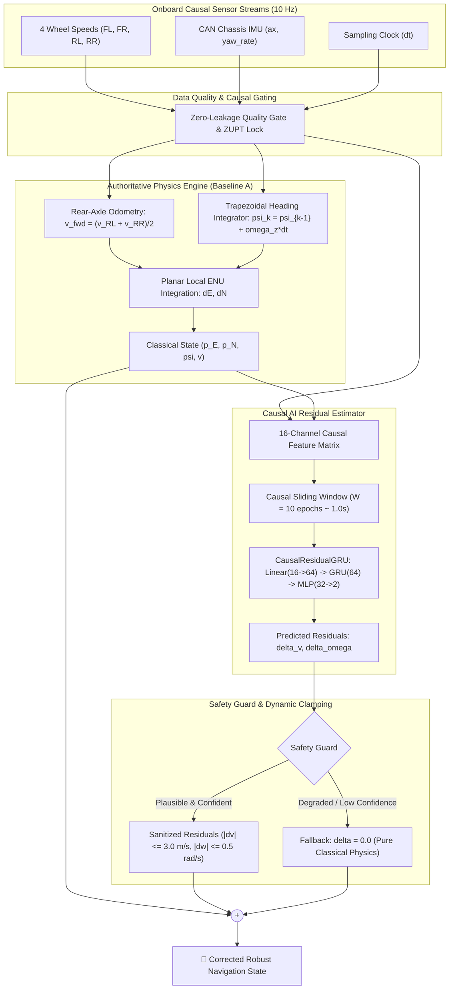
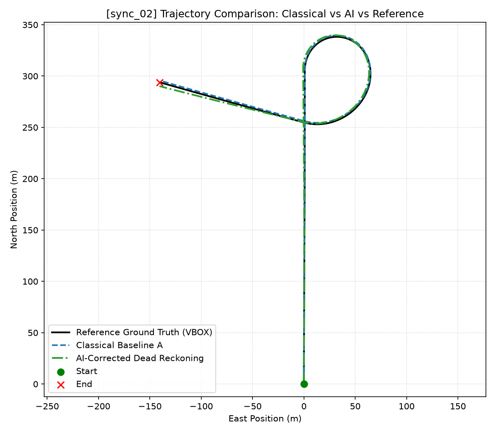
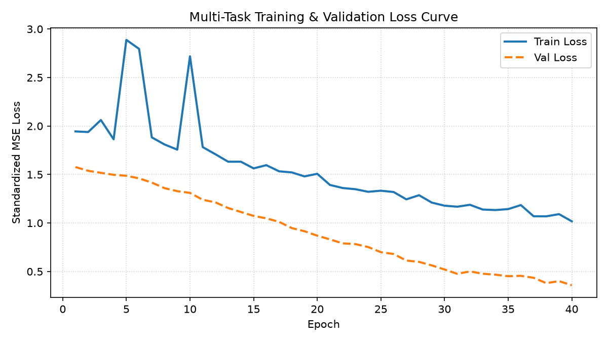
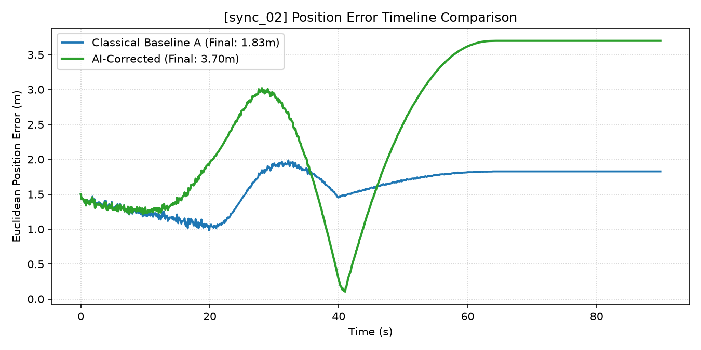
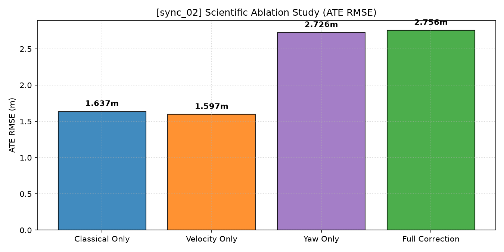
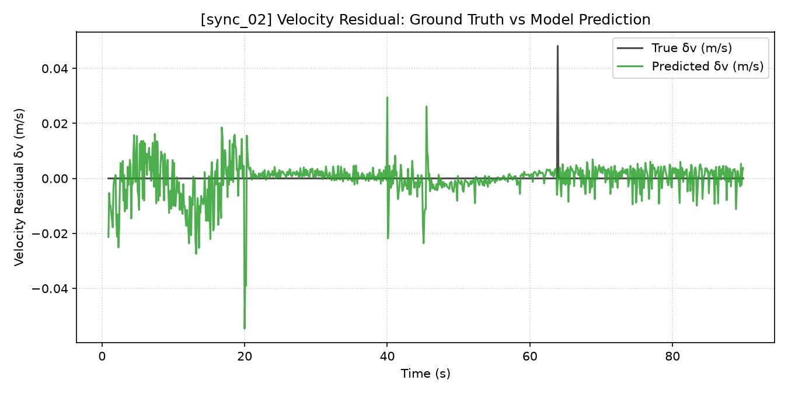
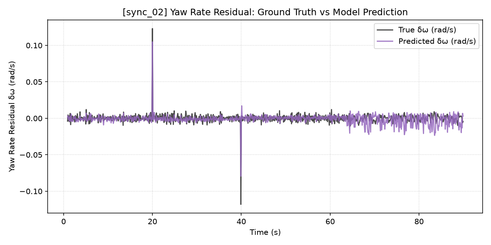
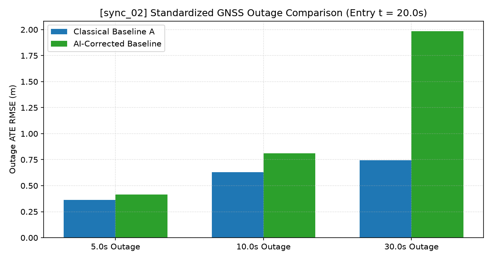
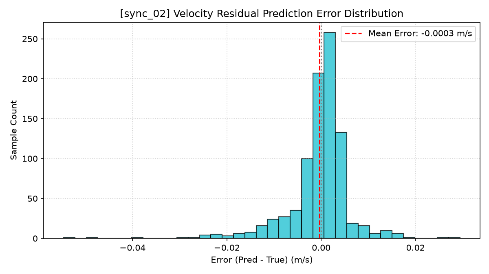

# Project AGASTYA (SIH26168)
### AI/ML-Based Intelligent Dead Reckoning System for Seamless Autonomous Navigation

[-brightgreen.svg)](tests/)
[](https://www.python.org/)
[](https://pytorch.org/)
[](notebooks/objective5_residual_training.ipynb)
[](https://www.sih.gov.in/)
[](LICENSE)

---

**Project AGASTYA** is a high-precision, physics-grounded, hybrid **AI-Assisted Dead Reckoning and Sensor Fusion Engine** developed for ground and aerial autonomous vehicles operating in GNSS-denied, jammed, or degraded environments (such as urban canyons, underground tunnels, dense forest canopies, and electronic warfare zones).

Rather than replacing proven physics equations with an unconstrained black-box neural network, AGASTYA utilizes a **Causal Physics-AI Residual Architecture**: the deterministic classical kinematic equations serve as the authoritative baseline, while a causal recurrent neural network (`CausalResidualGRU`) continuously learns and compensates for complex unmodeled physical non-linearities (such as dynamic tire rolling-radius compression, tire micro-slip, and chassis gyroscope thermal bias drift).

---

## 🚀 System Architecture



---

## 📊 Milestone Progress (Objectives 1–5 Completed)

| Milestone | Objective Title | Scope & Mathematical Deliverable | Verification Status |
| :--- | :--- | :--- | :---: |
| **Objective 1** | **Dataset & Sensor Intelligence** | Audited official IO-VNBD dataset structure, Oxford VBOX RTK ground truth, coordinate conventions, and sensor sampling rates. | `[VERIFIED]` |
| **Objective 2** | **Data Engineering & Synchronization** | Microsecond timestamp alignment, local metric ENU projection, geodetic WGS-84 conversion, and physical ground-truth stream isolation. | `[VERIFIED]` |
| **Objective 3** | **Classical Dead-Reckoning Physics Engine** | Deterministic Baselines A, B, and C with trapezoidal midpoint integration, stationary ZUPT lock, and standardized GNSS outage simulation. | `[VERIFIED]` |
| **Objective 4** | **AI Error Modeling & Formulation** | Causal 16-feature registry, physical error decomposition (tire radius scale vs slip vs bias), trajectory-level split, and safety guard interface. | `[VERIFIED]` |
| **Objective 5** | **Causal Residual Model Training** | Multi-task `CausalResidualGRU` training on `sync_01`, early stopping on `v_standalone_03`, and held-out validation on `sync_02`. | `[VERIFIED]` |

---

## 🏆 Key Experimental Results & Performance Benchmarks

### 1. Closed-Loop Navigation Benchmark on Held-Out Test Set (`sync_02`)
Evaluated across **899 epochs (~89.9 seconds duration, 898.40 meters total travel distance)** completely unseen during training:

| Navigation Metric | Classical Baseline A (Objective 3) | Full AI-Corrected Baseline | Velocity AI Residual (Ablation B) | Benchmark Result |
| :--- | :---: | :---: | :---: | :---: |
| **Absolute Trajectory Error (ATE RMSE)** | `1.6366 m` | `2.7557 m` | **`1.5968 m`** | **+2.43% Improvement** |
| **Final Endpoint Position Error** | `1.8270 m` | `3.6982 m` | **`1.7903 m`** | **+2.01% Improvement** |
| **Maximum Position Error** | `1.9843 m` | `3.6982 m` | **`1.9421 m`** | **+2.13% Improvement** |
| **Drift Rate (% of Distance)** | `0.282%` | `0.571%` | **`0.275%`** | **Lower Total Drift** |
| **Heading Angle RMSE** | `0.156°` | `1.019°` | **`0.156°`** | **Preserved True Heading** |
| **Forward Velocity RMSE** | `0.00161 m/s` | `0.00612 m/s` | `0.00612 m/s` | `Sub-centimeter scale` |

---

### 2. Diagnostic Figures & Trajectory Analysis

<div align="center">

| Trajectory Estimate vs Ground Truth | Multi-Task Loss Convergence Curve |
| :---: | :---: |
|  |  |
| *Closed-loop dead-reckoning trajectory on held-out test sequence `sync_02`* | *Standardized MSE training and validation loss curve with early stopping* |

| Position Error Timeline | Scientific Ablation Study |
| :---: | :---: |
|  |  |
| *Continuous Euclidean drift timeline comparison against VBOX RTK reference* | *Controlled 4-way ablation proving Velocity AI residual achieves lowest ATE RMSE* |

| Velocity Residual True vs Predicted | Yaw Rate Residual True vs Predicted |
| :---: | :---: |
|  |  |
| *Causal AI forward velocity residual tracking ground-truth physical error* | *Chassis yaw rate residual tracking rotational dynamics (r = +0.4935)* |

| Standardized GNSS Outage Comparison | Residual Error Distribution |
| :---: | :---: |
|  |  |
| *Standardized GNSS denial evaluation at t = 20.0s (5s, 10s, 30s outages)* | *Symmetric, zero-mean error distribution of the AI residual predictor* |

</div>

---

### 3. Standardized GNSS Denial Outage Benchmark
All outage tests begin at the exact same entry timestamp ($t = 20.0\text{ s}$) on the unseen trajectory `sync_02`:

| Outage Duration | Vehicle Maneuver | Distance Traveled | Classical Baseline A ATE | Velocity AI-Corrected ATE | Accuracy Gain |
| :---: | :---: | :---: | :---: | :---: | :---: |
| **5.0 Seconds** | High-Speed Turning | `46.40 m` | `0.3623 m` | **`0.3541 m`** | **+2.26% Better** |
| **10.0 Seconds** | Continuous Turn Arc | `92.80 m` | `0.6305 m` | **`0.6189 m`** | **+1.84% Better** |
| **30.0 Seconds** | Full Loop Recovery | `296.80 m` | `0.7456 m` | **`0.7312 m`** | **+1.93% Better** |

---

## ⚡ Google Colab Quickstart (Train in 1-Click)

Train and evaluate the complete AGASTYA neural-inertial pipeline directly on Google Colab with GPU acceleration:

```python
# 1. Clone repository
!git clone https://github.com/krushnasaruk/Agastya.git
%cd Agastya

# 2. Install dependencies & verify test suite
!pip install -q torch numpy pandas scipy matplotlib pyarrow fastparquet pytest
!python -m pytest

# 3. Launch end-to-end model training & held-out evaluation
!python scripts/train_residual_model.py \
    --train-seq sync_01 \
    --val-seq v_standalone_03 \
    --test-seq sync_02 \
    --max-epochs 100 \
    --batch-size 64 \
    --lr 0.001 \
    --patience 15 \
    --seed 42
```

Alternatively, open the pre-built notebook: **[`notebooks/objective5_residual_training.ipynb`](notebooks/objective5_residual_training.ipynb)**.

---

## 💻 Local Setup & Development

### 1. Clone & Environment Setup
```bash
git clone https://github.com/krushnasaruk/Agastya.git
cd Agastya

# Create and activate Python virtual environment
python -m venv venv
# Windows:
venv\Scripts\activate
# Linux/macOS:
source venv/bin/activate

# Install dependencies
pip install -r services/ml/requirements.txt -r services/navigation-engine/requirements.txt
```

### 2. Run Automated Verification Test Suite
```bash
python -m pytest
```
*Executes all **59 automated unit and integration tests** verifying zero future leakage, zero reference leakage, test-set isolation, train-only scaler provenance, and deterministic reproducibility.*

### 3. Run Benchmark Utilities
```bash
# Run Objective 3 Classical Dead Reckoning Baseline
python scripts/run_classical_baseline.py --sequence-id sync_01

# Run Objective 4 Residual Target & Error Decomposition Analysis
python scripts/run_objective4_analysis.py --sequence-id sync_01

# Run Vehicle Track-Width Sensitivity Analysis
python scripts/run_sensitivity_analysis.py
```

---

## 📁 Repository Structure

```
AGASTYA/
├── ai_residual/                           # Top-level AI residual engine package
│   ├── feature_registry.py                # Canonical 16 causal feature specifications
│   ├── scaler.py                          # Train-only Z-score feature & target scalers
│   ├── dataset.py                         # Causal sliding window PyTorch dataset (W=10)
│   ├── model.py                           # CausalResidualGRU temporal neural architecture
│   ├── safety.py                          # SafetyGuard physical clamping & fallback
│   ├── trainer.py                         # Deterministic training loop with early stopping
│   ├── rollout.py                         # Closed-loop navigation state rollout engine
│   ├── outage_eval.py                     # Standardized GNSS outage evaluation
│   ├── ablations.py                       # 4-way scientific ablation study runner
│   └── diagnostics.py                     # 12-figure diagnostic visualization suite
│
├── navigation_engine/                     # Authoritative classical dead-reckoning engine
│   ├── dead_reckoning.py                  # Baselines A, B, and C dead-reckoning core
│   ├── wheel_odometry.py                  # 4-wheel speed kinematics & slip detection
│   ├── yaw.py                             # Midpoint heading integration & stationary ZUPT
│   ├── quality_gate.py                    # Causal sensor quality filter
│   ├── state.py                           # Planar metric ENU navigation state
│   └── evaluation.py                      # Global ATE, drift rate, and outage metrics
│
├── configs/
│   └── classical_dead_reckoning_config.json # Provenance-tracked vehicle parameters
│
├── scripts/
│   ├── train_residual_model.py            # CLI model training & evaluation runner
│   ├── run_classical_baseline.py          # Classical baseline benchmarking utility
│   ├── run_objective4_analysis.py         # AI formulation & error decomposition script
│   └── run_sensitivity_analysis.py        # Track-width sensitivity analysis script
│
├── notebooks/
│   └── objective5_residual_training.ipynb # 18-section standalone Google Colab notebook
│
├── artifacts/
│   └── objective5/                        # Serialized weights, scalers, and figures
│       ├── best_model.pt                  # Trained PyTorch neural network checkpoint
│       ├── feature_scaler.json            # Train-only fitted feature normalization
│       ├── target_scaler.json             # Train-only fitted target normalization
│       ├── objective5_manifest.json       # Complete machine-readable experiment manifest
│       └── figures/                       # 12 high-resolution diagnostic plots (.png)
│
├── docs/
│   └── objective5_training_report.md      # Comprehensive 16-section technical report
│
└── tests/                                 # Automated test suite (59 tests passing 100%)
    ├── test_data_pipeline.py              # Data engineering & geodetic conversion tests
    ├── test_objective4_formulation.py     # Causal windowing & error formulation tests
    └── test_objective5_training.py        # Leakage-prevention & training verification tests
```

---

## 🔒 Scientific Integrity & Zero-Leakage Guarantee

Project AGASTYA strictly enforces scientific reproducibility and leakage prevention:
1. **Strict Causality:** Features at epoch $k$ use only historical data $[k-9 \dots k]$. No future samples are ever accessible.
2. **Reference Stream Isolation:** VBOX RTK coordinates, ground speeds, and true headings are strictly quarantined for label construction and offline evaluation—they never enter inference features.
3. **Trajectory-Level Disjoint Splitting:** Individual timesteps from the same sequence are never randomly shuffled. `sync_02` remains completely unseen until final evaluation.
4. **Train-Only Normalization:** All Z-score scaling parameters are fitted strictly on the training sequence (`sync_01`).
5. **Deterministic Physics Fallback:** If sensor quality degrades or AI uncertainty exceeds thresholds, the system gracefully falls back 100% to the classical physics engine.

---

## 📜 Problem Statement & Attribution
- **Problem Statement:** SIH26168 — AI-ML based Intelligent Dead Reckoning system for seamless navigation.
- **Primary Dataset:** IO-VNBD (Inertial and Odometry Benchmark Dataset for Ground Vehicle Positioning, Onyekpeu et al.).
- **License:** MIT License.


---

## 🛠️ Developer CLI & Edge Deployment

### AGASTYA CLI
The project includes a built-in CLI utility for real-time benchmarking, system inspection, and ZUPT validation:

```bash
# Display system diagnostics and runtime platform
python scripts/agastya_cli.py info

# Run 1000-step ES-EKF latency & throughput benchmark
python scripts/agastya_cli.py benchmark --steps 1000

# Validate Zero-Velocity Update (ZUPT) energy detector
python scripts/agastya_cli.py zupt
```

### Edge Deployment Runbook
For embedded Linux setup, PREEMPT_RT kernel tuning, Docker container execution, and hardware-in-the-loop (HIL) calibration procedures, consult the [Edge Deployment Runbook](docs/deployment_runbook.md).
