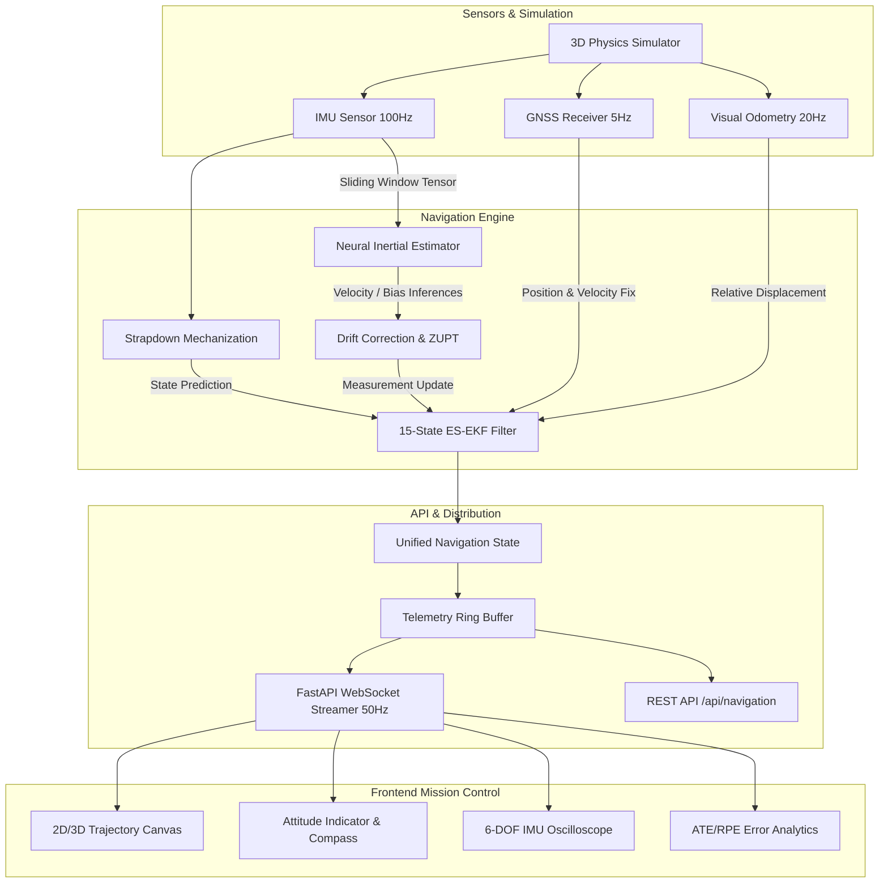

# AGASTYA System Architecture

## 1. High-Level Architecture Overview

The AGASTYA AI Dead Reckoning system is architected as an asynchronous, low-latency, modular sensor fusion and neural kinematic estimation pipeline. It operates across multiple frequencies to fuse high-rate inertial measurements with low-rate external aiding sources and neural trajectory inference.

---

## 2. Microservice & Component Breakdown

### 2.1 Navigation Engine (`services/navigation-engine`)
- **Strapdown Inertial Navigation System (SINS)**: Integrates specific force and angular velocity in the North-East-Down (NED) navigation frame using 4th-order Runge-Kutta numerical integration.
- **Error-State Extended Kalman Filter (ES-EKF)**: Maintains a 15-dimensional error state:
  $$\delta \mathbf{x} = [\delta \mathbf{p}, \delta \mathbf{v}, \delta \boldsymbol{\theta}, \delta \mathbf{b}_a, \delta \mathbf{b}_g]^T \in \mathbb{R}^{15}$$
  State updates are applied indirectly to the nominal state (position, velocity, unit quaternion, biases), resetting the error state after each correction.
- **Sensor Fusion Dispatcher**: Manages asynchronous arrivals from multi-rate sensors with timestamps, maintaining causality and time-synchronized sensor alignment.

### 2.2 Machine Learning Subsystem (`services/ml`)
- **Deep Neural Velocity Regressors**:
  - `BiLSTMDeadReckoning`: Bidirectional LSTM with temporal attention extracting displacement vectors $\Delta \mathbf{p}_{t-W:t}$ from IMU windows.
  - `InertialTransformer`: Multi-head self-attention network capturing multi-scale temporal dependencies and nonlinear motion dynamics.
- **Zero-Velocity Detector (ZUPT)**: Real-time classifier detecting stationary phases to reset velocity and constrain drift.

### 2.3 API Service (`services/api`)
- **FastAPI Core**: Asynchronous ASGI framework handling REST endpoints and WebSockets.
- **WebSocket Broadcast Engine**: Broadcasts compact JSON telemetry packets at 50Hz to connected clients, including ground truth, estimated states, raw GNSS fixes, pure dead reckoning track, error bounds, and sensor signals.

### 2.4 Cyber-Avionics Frontend (`frontend`)
- **Interactive Multi-Track Visualizer**: Canvas-based 2D/3D renderer drawing real-time trajectories with dynamic covariance error ellipses.
- **Primary Flight Display (PFD)**: Artificial horizon, roll ladder, compass ring, vertical speed, and altitude indicators.
- **Oscilloscopes**: Live multi-channel waveform plots for accelerometer and gyroscope signals.

---

## 3. Data Flow & Latency Budget

| Pipeline Stage | Nominal Frequency | Execution Latency |
| :--- | :--- | :--- |
| IMU Read & Preprocessing | 100 Hz | < 0.15 ms |
| SINS Propagation & RK4 | 100 Hz | < 0.30 ms |
| ES-EKF Covariance Propagation | 100 Hz | < 0.45 ms |
| ML Window Inference (PyTorch) | 20 Hz | < 2.50 ms |
| GNSS / VO Measurement Update | 5 - 20 Hz | < 0.80 ms |
| WebSocket Telemetry Broadcast | 50 Hz | < 1.00 ms |
| Frontend Render Loop (Canvas) | 60 FPS | ~ 16.6 ms |

Total end-to-end processing latency from raw IMU packet to fused state delivery is **< 4.5 ms**, well within real-time mission-critical avionics constraints.
