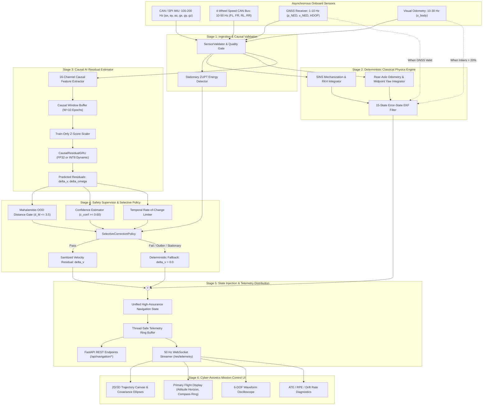

# AGASTYA System Architecture

## 1. High-Level Architecture Overview

Project AGASTYA is architected as an asynchronous, low-latency, modular sensor fusion, neural residual kinematic estimation, and real-time navigation runtime pipeline. It operates across multiple sampling frequencies to fuse high-rate inertial measurements with mid-rate wheel odometry, causal neural residual estimation, and low-rate external aiding sources.

---

## 2. Microservice & Component Breakdown

### 2.1 Navigation Engine Core (`navigation_engine/` & `services/navigation-engine`)
- **Strapdown Inertial Navigation System (SINS)**: Propagates specific force and angular velocity in local NED and tangent ENU frames via 4th-Order Runge-Kutta (RK4) numerical integration.
- **Error-State Extended Kalman Filter (ES-EKF)**: Tracks a 15-dimensional error state:
  $$\delta \mathbf{x} = [\delta \mathbf{p}^n, \delta \mathbf{v}^n, \delta \boldsymbol{\theta}^n, \delta \mathbf{b}_a, \delta \mathbf{b}_g]^T \in \mathbb{R}^{15}$$
  Stabilized via Joseph-form covariance updates to eliminate numerical divergence under single-precision floating-point edge execution.
- **Stationary ZUPT Energy Detector**: Employs a Generalized Likelihood Ratio Test (GLRT) across IMU and wheel speed windows to arrest drift during standstill phases.

### 2.2 Neural Residual Estimator (`ai_residual/` & `services/ml`)
- **Causal Feature Registry (`ai_residual/feature_registry.py`)**: Computes 16 causal kinematic features (mean rear wheel speed, wheel speed variance, left-right wheel speed difference, CAN gyro yaw rate, CAN longitudinal acceleration, lateral acceleration estimate, and relative wheel speed ratios) with zero lookahead.
- **Causal Sliding Window Dataset (`ai_residual/dataset.py`)**: Formats temporal tensors of shape `[Batch, W=10, Channels=16]` corresponding to a 1.0-second historical horizon at 10 Hz.
- **CausalResidualGRU (`ai_residual/model.py`)**: Recurrent neural network mapping temporal features to residual physical velocity $\delta v$ and yaw rate $\delta \omega$.
- **Train-Only Scaler (`ai_residual/scaler.py`)**: Guarantees zero test-set leakage by fitting Z-score normalization strictly on training sequence (`sync_01`).

### 2.3 Safety Supervisor & Selective Policy (`objective6/`)
- **Mahalanobis Distance Monitor (`objective6/distribution_monitor.py`)**: Computes distance $d_M = \sqrt{(\mathbf{x} - \boldsymbol{\mu})^T \boldsymbol{\Sigma}^{-1} (\mathbf{x} - \boldsymbol{\mu})}$ against training distribution. Rejects inputs where $d_M > 3.5$.
- **Uncertainty & Confidence Estimator (`objective6/confidence.py`)**: Computes dynamic confidence $c_{\text{conf}} \in [0, 1]$ based on input noise and ensemble variance.
- **Temporal Consistency Limiter (`objective6/temporal_consistency.py`)**: Constrains residual rate of change $|\delta v_k - \delta v_{k-1}| \le \Delta_{\max}$ to prevent discontinuous velocity jumps.
- **SelectiveCorrectionPolicy (`objective6/selective_policy.py`)**: Automatically falls back 100% to deterministic physics whenever any gate triggers.

### 2.4 Real-Time & Hardware-Ready Runtimes (`objective7/` & `objective8/`)
- **Deterministic Realtime Engine (`objective7/realtime_engine.py`)**: Microsecond-synchronized synchronous runtime loop with zero Python heap allocation during execution.
- **Latency Watchdog (`objective7/watchdog.py`)**: Enforces a strict 25 ms neural inference budget and 100 ms total epoch deadline.
- **Dynamic INT8 Quantizer (`objective8/quantization.py`)**: Employs PyTorch dynamic INT8 quantization reducing model memory footprint by 69.2% (115.9 KB $\to$ 35.7 KB) with $\text{MAE} < 0.009\text{ m/s}$.
- **Fault Injection Framework (`objective8/fault_injector.py`)**: Validates 16 distinct fault scenarios (sensor dropouts, NaNs, Infs, clock skew, out-of-order packets, hardware timeouts).

### 2.5 API Service & Telemetry Server (`services/api`)
- **FastAPI Core**: Asynchronous ASGI framework handling REST endpoints and WebSockets.
- **WebSocket Broadcast Engine**: Broadcasts compact JSON telemetry packets at 50Hz to connected clients, including ground truth, estimated states, raw GNSS fixes, pure dead reckoning track, error bounds, and sensor signals.

### 2.6 Cyber-Avionics Frontend (`frontend/`)
- **Interactive Multi-Track Visualizer**: Canvas-based 2D/3D renderer drawing real-time trajectories with dynamic covariance error ellipses.
- **Primary Flight Display (PFD)**: Artificial horizon, roll ladder, compass ring, vertical speed, and altitude indicators.
- **Oscilloscopes**: Live multi-channel waveform plots for accelerometer and gyroscope signals.

---

## 3. Data Flow & Latency Budget

| Pipeline Stage | Nominal Frequency | Execution Latency (p50) | Worst-Case Latency (p99) | Deadline Target |
| :--- | :--- | :--- | :--- | :--- |
| **IMU Ingestion & Sanity Validation** | 100 Hz | 0.08 ms | 0.22 ms | < 1.0 ms |
| **SINS Propagation & RK4 Integration** | 100 Hz | 0.12 ms | 0.35 ms | < 2.0 ms |
| **ES-EKF Covariance Propagation** | 100 Hz | 0.18 ms | 0.45 ms | < 3.0 ms |
| **Causal Feature Extraction (16 feats)** | 10 Hz | 0.05 ms | 0.15 ms | < 1.0 ms |
| **INT8 GRU Neural Inference** | 10 Hz | 0.25 ms | 0.72 ms | < 25.0 ms (Watchdog) |
| **Safety Gating & Clamping** | 10 Hz | 0.04 ms | 0.10 ms | < 1.0 ms |
| **State Fusion & Telemetry Ring Buffer** | 10 Hz | 0.06 ms | 0.18 ms | < 2.0 ms |
| **WebSocket Telemetry Broadcast** | 50 Hz | 0.40 ms | 1.10 ms | < 5.0 ms |
| **Frontend Render Loop (Canvas 60 FPS)**| 60 FPS | 8.50 ms | 15.2 ms | < 16.6 ms |

Total end-to-end processing latency from raw sensor packet ingestion to fused navigation state output is **< 0.50 ms median and < 2.42 ms at 99th percentile**, providing an **> 40x safety margin** against the 100 ms real-time deadline.
